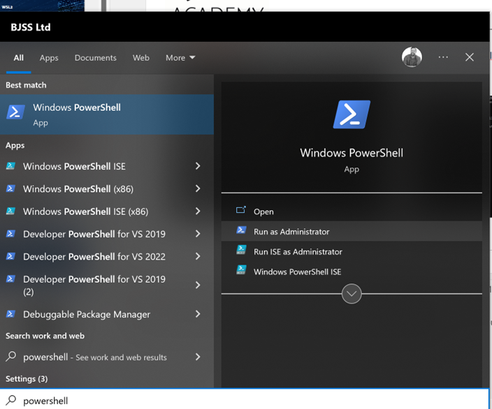
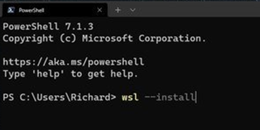
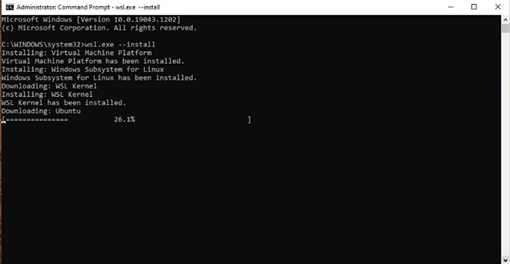
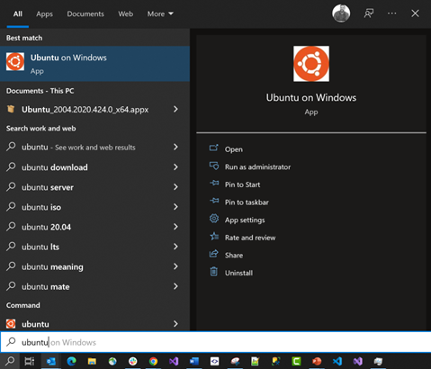
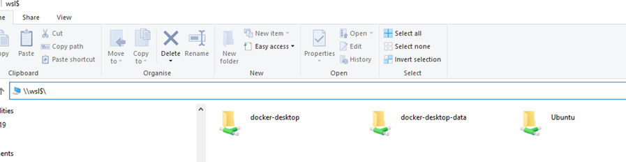
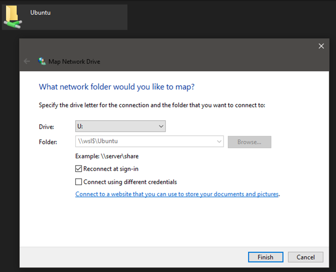

# Windows Subsystem for Linux

## What is it?

You: Hey, have you heard about WSL? I keep seeing it mentioned, but I’m not quite sure what it is.

Me: Yeah, WSL stands for *Windows Subsystem for Linux*. It's a really cool feature that Microsoft introduced to allow you to run a Linux environment directly on Windows, without needing a virtual machine.

You: So, it’s like having Linux and Windows at the same time?

Me: Yep, it’s like having the best of both worlds. You can run Linux commands, scripts, and even graphical Linux applications side-by-side with your Windows applications. It’s really handy for developers and sysadmins who need to work with both operating systems.

You: How does it work? Do I need to install a separate Linux OS?

Me: Not really. WSL integrates right into Windows. You can install different Linux distributions like Ubuntu, Debian, or Fedora from the Microsoft Store, and they run as lightweight environments directly on your Windows kernel.

You: How do I get started with WSL?

Me: It’s pretty straightforward. You just need to enable it on your Windows machine. Here’s a quick rundown:

1. Open PowerShell as Administrator.
2. Run the command: `wsl --install`. This will enable the necessary features, install the WSL 2 kernel, and download a default Linux distribution like Ubuntu.
3. Restart your computer if prompted.

You: So, after I install it, how do I actually use it?

Me: Once installed, you can launch your Linux distribution from the Start menu just like any other app. It opens up a terminal window where you can start using Linux commands. You can also access your Windows file system from within Linux, and vice versa.

You: That’s pretty neat. What’s the difference between WSL 1 and WSL 2?

Me:  WSL 1 was the original version, which used a translation layer to convert Linux system calls to Windows system calls. It worked well, but had some limitations in compatibility and performance. WSL 2, on the other hand, uses a full Linux kernel running in a lightweight virtual machine. This gives you much better performance and full compatibility with Linux applications.

You: So, WSL 2 is better?

Me: For most use cases, yes. WSL 2 provides a more complete Linux experience. It’s faster, more compatible, and allows you to run Docker and other tools that rely on the Linux kernel.

You: Can I switch between WSL 1 and WSL 2?

Me: Yes, you can. You can set the default version for new installations or convert existing distributions between WSL 1 and WSL 2. Here’s how:

To set the default version:

```ps
wsl --set-default-version 2
```

To convert an existing distribution:

```ps
wsl --set-version distribution-name 2
```

You: Any tips on what to try first with WSL?

Me: Sure! Here are a few ideas:

* Try out some basic Linux commands like ls, grep, and top.
* Install development tools like Git, Node.js, Python, or Ruby.
* Run a web server using Apache or Nginx.
* Use Docker to manage containers natively.
* Experiment with bash scripting to automate tasks.


## Installing WSL

1.	Open PowerShell as Administrator

> TIP: To find PowerShell, click on the magnifying glass icon in the bottom left of the screen and type in “powershell”


 
2.	In the PowerShell console, type ```wsl --install``` and press Enter:
 
 
 
3.	WSL will now start installing:



 
4.	Once complete, the system should ask you to reboot your computer. **Reboot your computer**.
5.	After restarting, Ubuntu should open and continue installing. It will ask you to create a username (all lower case) and a password.
    a.	If Ubuntu does *not* start, search for it in the menu and open it
        i.	No Ubuntu listed? Go to step 6
6.	After this is complete open PowerShell as Administrator
7.	Check your WSL version is version 2 by typing `wsl --list --verbose` and press Enter
    a.	If you get a message saying that WSL is installed but you have no distribution, type `wsl -–install -d ubuntu` and press Enter
    b.	If your version is showing as version 1, type `wsl --set-version Ubuntu 2` and press Enter
8.	Now open the Ubuntu app from the Start menu:
 


9.	In the Ubuntu console window that appears, run the following commands one by one:
 
 ```bash
sudo apt-get update
sudo apt-get upgrade
sudo apt-get dist-upgrade
sudo apt-get autoremove
 ```
 
## Accessing Files
Linux files can be accessed at the network path `\\wsl$\`. This can be entered into the File Explorer address bar:


 
Your installed Linux distros are listed, so you can access the Ubuntu root directory at `\\wsl$\Ubuntu`. 

Your personal files will typically be stored at:
`\\wsl$\Ubuntu\home\<yourname>`

## Map A Network Drive [OPTIONAL]
You can mount a network drive to `\\wsl$\Ubuntu` by opening `\\wsl$\` in File Explorer, right clicking the Ubuntu folder, and choosing **Map network drive…**


 
## Access Windows Files From Linux

> NOTE: Accessing Windows files from Linux is considerably slower than using the native Linux file system. Where possible, create projects within the Linux file space, typically within your home folder (/home/<yourname>/ or ~).

## Installing Applications

Always remember you’re running **two** operating systems. They may be highly integrated, but there are situations when you want an application installed in one or both.
It may be practical to use Git from either Windows or Linux. The Windows edition is installed by downloading an executable (or chocolatey), but Git on Ubuntu is installed using:

```bash
sudo apt-get update
sudo apt-get install git-all
```

Execute both commands in the Ubuntu console to install git.
